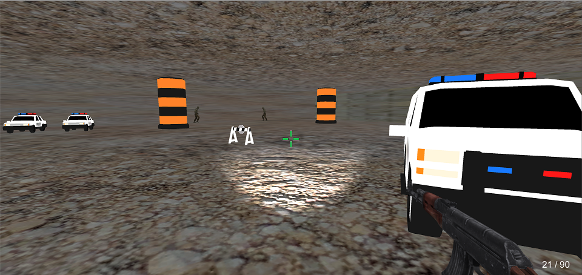
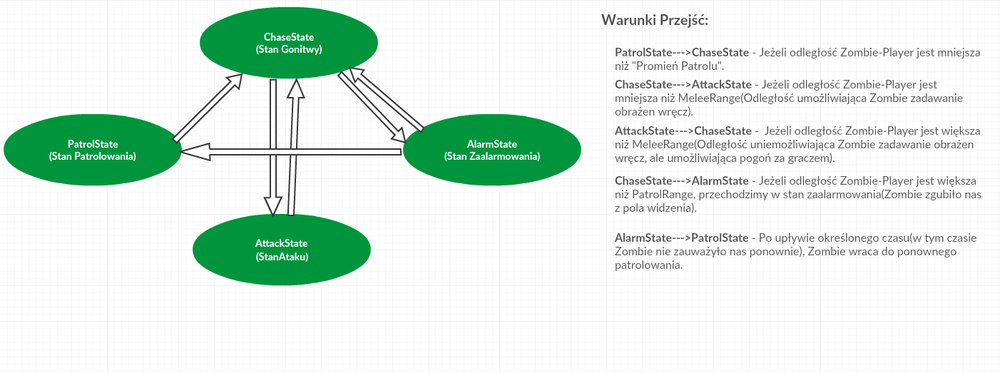
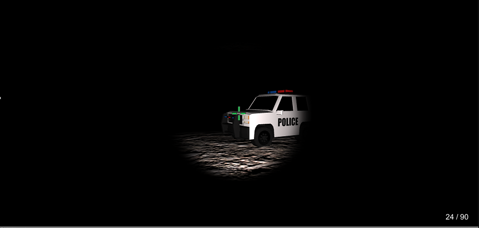

# GameDev-ZombiePolice

## [INFO]
Projekt został wykonany w ramach jednego z zadań zaliczeniowych na zajęciach programowania gier.Głównym założeniem było skonstruowanie
FSM i analiza poszczególnych faz przejść.Jak to przy projektowaniu gier bywa, wymaga on wielu poprawek i ulepszeń, jednakże na ten moment projekt porzucam i uważam za zamknięty. Chciałbym też dodać, że to było moje pierwsze spotkanie z Unity i na pewno nie ostatnie ! :smile:
## [Finite State Machine]

## [SCREEN]

## [TOOLS]
-Unity 2019
-Visual Studio 2017

## [MODELS]
Zombie: https://assetstore.unity.com/packages/3d/characters/humanoids/zombie-30232
Cars/Signs: https://assetstore.unity.com/packages/3d/vehicles/land/low-poly-police-car-pack-59458
AKM: https://assetstore.unity.com/packages/3d/props/guns/akm-72911
