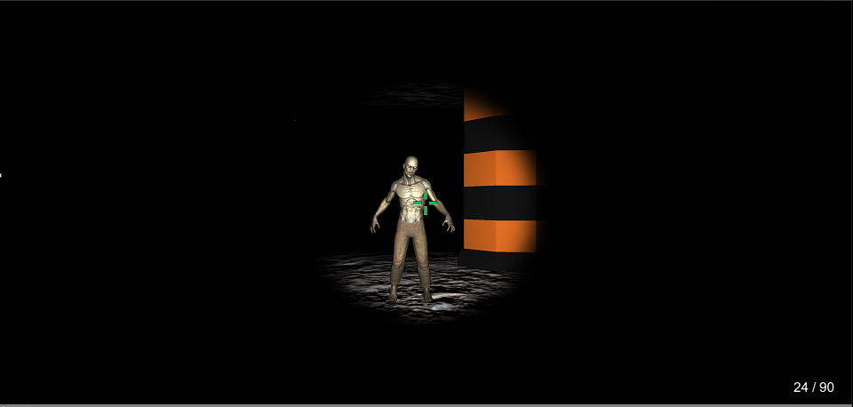

# GameDev-ZombiePolice

## [INFO]
Projekt został wykonany w ramach jednego z zadań zaliczeniowych na zajęciach programowania gier.Głównym założeniem było skonstruowanie
FSM i analiza poszczególnych faz przejść.Jak to przy projektowaniu gier bywa, wymaga on wielu poprawek i ulepszeń, jednakże na ten moment projekt porzucam i uważam za zamknięty. Chciałbym też dodać, że to było moje pierwsze spotkanie z Unity i na pewno nie ostatnie ! :smile:
## [Finite State Machine]

## [SCREEN]

## [TOOLS]
